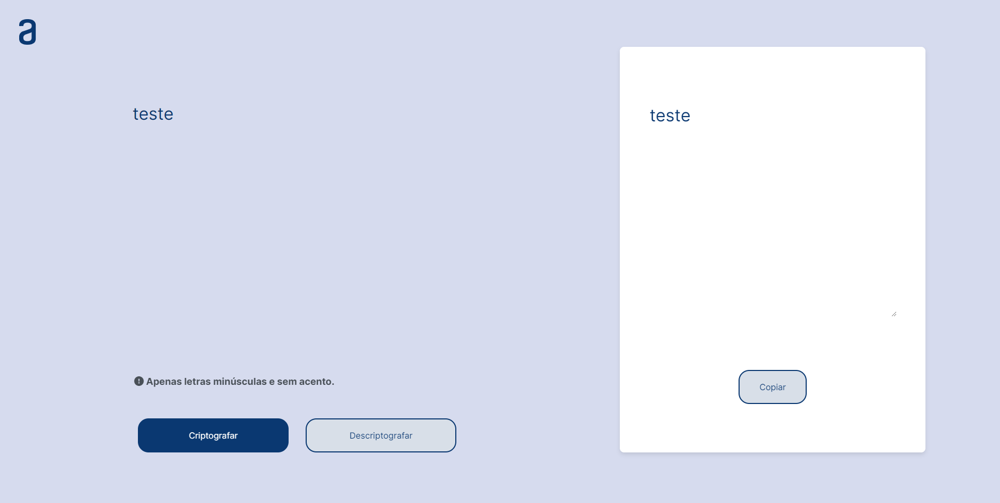

# Alura Challenge - Decodificador de texto

Olá a todos, sejam muito bem vindos ao projeto **Alura Challenge - decodificador de texto**. Aqui você encontra um programa de [de]codificação de mensagens, ideal para compartilhar informações e conversar com os amigos(as). Eae, achou interessante? Vem conhecer!

## 🔨 Funcionalidade

A funcionalidade básica desse projeto fazer o decodificador de mensagens de texto. Para isso, o usuário entra com uma mensagem e escolhe por meio de botões se quer codificar ou decodificar, e por fim aparece o resultado em um modal, onde é possível realizar a cópia para área de transferência.
  

## 🚀 Tecnologias utilizadas

## 📁 Clonar repositório

Clone este repositório via Bash, usando:

  

✅ HTTPS:

~~~~ bash

git  clone  https://github.com/hugopassosdev/challenge-criptografia-one.git

~~~~

✅ SSH:

~~~~ bash

git  clone  git@github.com:hugopassosdev/challenge-criptografia-one.git

~~~~

✅ GitHub CLI:

~~~~ bash

gh repo clone hugopassosdev/challenge-criptografia-one

~~~~

✅ Download ZIP.

  

## 🌐 Acessar o projeto

O projeto encontra-se finalizado.

[Em breve veja o deploy por aqui](https://criptografia-kappa.vercel.app/)🔗

  

## 🛠️ Abrir e rodar

O projeto encontra-se finalizado.

  

## 👥 Contribuições

Contribuições são bem-vindas! Sinta-se à vontade para enviar pull requests ou relatar problemas.

  

## 📄 Licença

Este projeto está licenciado sob a Licença MIT. Consulte o arquivo LICENSE para obter detalhes.